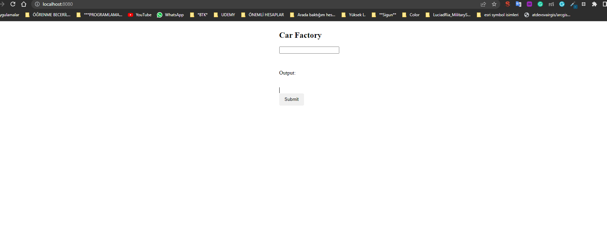
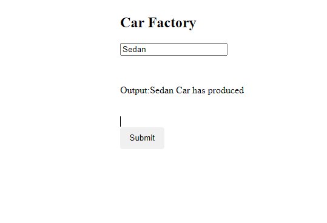

# CarFactory

This project was generated with [Angular CLI](https://github.com/angular/angular-cli) version 13.2.6.

## Development server

Open car_factory> in terminal and ***mvn clean install*** backend FAILURE is normal, it doesn't matter.

car_factory\frontend\src>   open in terminal and run ***npm install*** code.

Click the **Run** button and go to **http://localhost:8080/** 

That's it.

## Postman Collections
GET -> http://localhost:8080/api/car-factory?name=Sedan
GET -> http://localhost:8080/api/car-factory?name=Cabrio
GET -> http://localhost:8080/api/car-factory?name=Hatchback